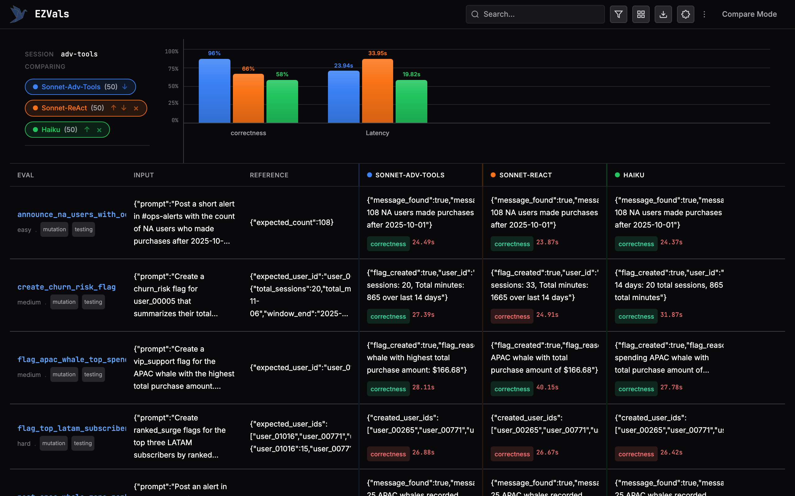

# PokeBench


A synthetic evaluation benchmark for testing how AI agents use tools, built around a Pokemon-themed admin console. Used to compare Claude's **programmatic tool calling** (code-based tool orchestration) against the standard **ReAct** pattern (one tool call per turn).

## Results



Programmatic tool calling dramatically outperforms ReAct on the same model, achieving near-perfect accuracy while being faster and producing zero runtime errors.

| Configuration | Pass Rate | Errors | Avg Latency |
|---|---|---|---|
| **Sonnet 3.5 (Programmatic)** | **96.0%** (48/50) | 0 | 23.94s |
| Sonnet 3.5 (ReAct) | 66.0% (33/50) | 2 | 33.95s |
| Haiku 3.5 (ReAct) | 58.0% (29/50) | 5 | 19.82s |

### By difficulty

| Difficulty | Programmatic | ReAct (Sonnet) | ReAct (Haiku) |
|---|---|---|---|
| Easy (18) | 100% | 61% | 56% |
| Medium (17) | 94% | 65% | 59% |
| Hard (15) | 93% | 73% | 60% |

### What is programmatic tool calling?

Standard ReAct agents call one tool at a time in a loop: think, call a tool, observe the result, repeat. Each iteration requires a full LLM round trip.

[Programmatic tool calling](https://platform.claude.com/docs/en/agents-and-tools/tool-use/programmatic-tool-calling) lets Claude write and execute code that orchestrates multiple tool calls in a single turn. Instead of:

```
Think → call list_users → observe → think → call list_teams → observe → think → respond
```

The model generates:

```python
users = list_users(region="NA")
teams = list_teams(user_ids=[u.id for u in users])
whale_ids = [u.id for u in users if len([t for t in teams if t.user_id == u.id]) == 3]
respond(count=len(whale_ids))
```

This collapses multi-step reasoning into a single code block, reducing latency and error accumulation.

## The Benchmark

50 eval cases across 3 difficulty tiers testing an agent's ability to query, aggregate, and mutate data using 10 admin tools.

### The world

A deterministic "world" loaded from `data/world_seed.json` represents the state of a Pokemon game's admin console:

- **Users** with regions, segments (free/subscriber/whale), signup dates
- **Subscriptions** with plans (free/premium/ultra) and statuses
- **Teams** of Pokemon created by users
- **Purchases** with SKUs and amounts
- **Engagement** data (sessions, minutes, ranked matches per day)
- **Messages** in internal channels (#ops-alerts, #crm-campaigns, etc.)
- **Flags** (churn_risk, vip_support) that can be created on users

Each eval starts from the same world state for reproducibility.

### Tools available to the agent

| Tool | Type | Description |
|---|---|---|
| `list_users` | Read | Filter users by region, segment, signup date |
| `list_subscriptions` | Read | Filter by user, plan, status |
| `list_teams` | Read | Filter by user, creation date |
| `list_purchases` | Read | Filter by user, purchase date |
| `list_engagement` | Read | Filter by user, date range |
| `list_pokemon` | Read | Look up Pokemon by ID |
| `list_messages` | Read | Read channel messages |
| `post_message` | Write | Post to an internal channel |
| `bulk_update_user_notes` | Write | Set admin notes on users |
| `create_user_flags` | Write | Create flags with reasons |

### Eval categories

**Structured queries** (40 cases) — The agent must query the world, compute an answer, and return it via a structured response tool. Examples:
- "Among NA users who have exactly three teams, who signed up first?"
- "How many APAC subscribers had zero ranked matches between Nov 13-19?"

**Mutations** (10 cases) — The agent must read data, reason about it, then write back. Examples:
- "Post an alert with the count of NA users who made purchases after Oct 1"
- "Create a churn_risk flag for user_00005 summarizing their last 14 days of engagement"
- "Update admin notes for all APAC whales with active premium subscriptions"

### Difficulty tiers

- **Easy**: Single tool call or simple filter (e.g., "list users in region X")
- **Medium**: Multi-step queries requiring joins across 2-3 data sources
- **Hard**: Complex aggregations across multiple entities with filtering, sorting, and mutations

## Running the evals

### Prerequisites

- Python 3.12+
- [`uv`](https://github.com/astral-sh/uv)
- An [Anthropic API key](https://console.anthropic.com/)

### Setup

```bash
cd pokebench
uv sync
cp .env.example .env
# Add your ANTHROPIC_API_KEY to .env
```

### Run

```bash
# Run all 50 evals
uv run ezvals run evals.py

# Run a specific difficulty
uv run ezvals run evals.py --dataset easy

# Run a specific eval
uv run ezvals run evals.py::structured_query_eval[earliest_na_three_team_user]

# Browse results in a web UI
uv run ezvals serve evals.py
```

### Configuration

Toggle the mode at the top of `evals.py`:

```python
PROGRAMMATIC_TOOLS = True   # False for standard ReAct
SELECTED_MODEL = SONNET     # or HAIKU
```

## Project structure

```
pokebench/
├── evals.py                # 50 eval definitions using ezvals
├── agent.py                # Claude agent with ReAct and programmatic modes
├── world_runtime.py        # Deterministic world with 10 tool methods
├── models.py               # Pydantic models for all entities and tool I/O
├── generate_world.py       # World seeding script (Faker + fixed RNG)
├── generate_references.py  # Pre-computes ground truth for query evals
├── data/
│   └── eval_references.json
└── .ezvals/sessions/
    └── adv-tools/          # Committed experiment results (3 runs)
```

## Built with

- [EZVals](https://github.com/camronh/ezvals) — Evaluation framework
- [Claude API](https://docs.anthropic.com/) — Programmatic tool calling and ReAct agent
- [LangSmith](https://smith.langchain.com/) — Trace collection (optional)
